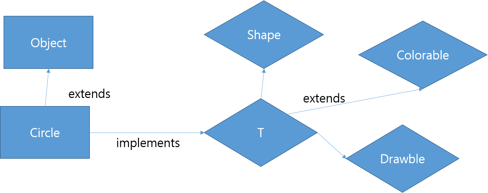
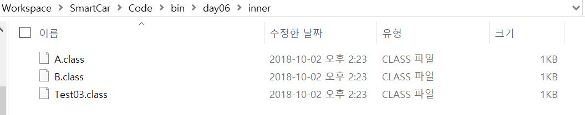

# 다형성(polymorphism)

### abstract class

- abstract 클래스는 객체 생성 불가함
  - 오로지 상속하기 위해 만듬

### abtract method 

- 바디부가 없는 메소드
  - abstrac method가 포함되 클래스는abstract class라 함
  - 반드시 오버라이딩을 해야함

```java
package day06;

public abstract class Animal {
	protected String kind = "동물의종류";
	public Animal() {
		super();
	}
    
	public Animal(String kind) {
		super();
		this.kind = kind;
	}
	
    
	public void print() {	}
	//apstract 메소드
	public abstract void breath();
}

```


### Interface

- final member variable 과 abstract method로만 구성
- 이러이러해야 한다라고 정의하기위한 역할(일종의 규약, 약속)
- implements 이용( 여러 인터페이스를 implements 할수 있음)
- ~able이라는 접미사를 많이 사용함
- 다중상속 가능
- 강제적인 틀을 잡아줄때 사용

```java
package day06;

public interface Shape {
	public abstract double area();

}

interface Colorable {
	public void color(String color);
}

interface Drawble {
	public void Draw();
}

interface T extends Shape, Colorable, Drawble{
	
}
```


public클래스는 한 파일안에 하나밖에 못만듬

```java
package day06;

public class Test02 {

	public static void main(String[] args) {
		// TODO Auto-generated method stub
		Circle c = new Circle();
		Rectangle r= new Rectangle();
		
		T s = c;
		s.Draw();
		((Colorable)s).color("RED");
		
		T[] t= {r,c};
		for(int i =0; i<t.length;i++) {
			t[i].Draw();
			t[i].color("yellow");
			System.out.println(t[i].area());
		}
	}

}

```

``` java
package day06;

//extends Object는 생략되어 있음
public class Circle extends Object implements T{
	int r = 3;
	
	@Override
	public double area() {
		return Math.PI * r * r;
	}

	@Override
	public void Draw() {
		// TODO Auto-generated method stub
		System.out.println("Circle 그리기");
		
	}
    
	@Override
	public void color(String color) {
		// TODO Auto-generated method stub
		System.out.println(color+"칠하기");
		
	}
}

class Rectangle implements T{
	int w = 7;
	int h = 3;
	@Override
	public double area() {
		return w*h;
	}
	@Override
	public void Draw() {
		// TODO Auto-generated method stub
		System.out.println("Rectangle 그리기");
	}
	@Override
	public void color(String color) {
		// TODO Auto-generated method stub
		System.out.println(color+"칠하기");	
	}	
}
```


- 전체 구조




### 이너클래스

- 이너클래스에선 아우터 클래스의 자원을 맘대로 사용가능
- 아우터 클래스에선 이너자원 사용하려면 객체생성해야 함

보통 클래스 생성시

이너클래스 생성시


```java
package day06.inner;

public class Test03 {
	public static void main(String[] args) {
		A a = new A();
		A.B b = new A().new B();
		b.print();
		
		
	}
}
//----------이너 클래스
class A{
	String name = "A";
	class B{
		void print() {
			System.out.println(name);
		}
	}
}
```


### 예외 처리

Exception의 예

- 파일이 존재하지 않는데 열려고 했을 경우

- 클래스 파일 로딩시 문제가 있는 경우

- 계산식 처리중 오류

- 네트워크 연결에 문제가 있어 끊겼을경우

  throw :: Exception이 발생하면 던져졌다라고 표현

  Exception :: 


예외 객체

- Unchecked Exception : ?

- Checked Exception : 반드시 try ~ catch로 잡아야함


final은 상속이 불가능

