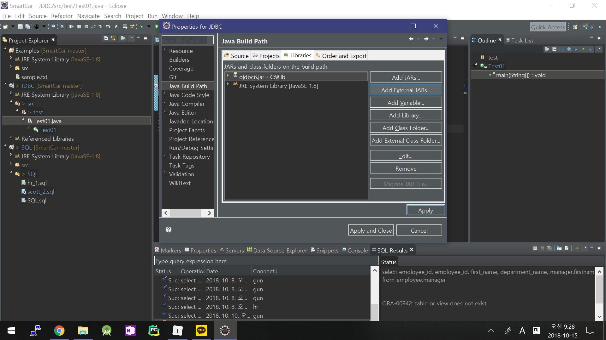

# JDBC

JDBC :자바 프로그램내에서 SQL문을 실행하기 위한 자바 API(java.sql 패키지)


### JDBC프로그래밍 순서 


>1. 연결할 driver클래스를 classpath아래==>~~maven 설정으로 대체~~
>2. Driver클래스를 로딩
>3. 로딩된 Driver클래스를 이용해서 Connection요청(url, user, pwd)
>4. 생성된Connection으로부터 Statement생성
>5. 생성된 Statement를 이용해서 sql수행(execute, executeUpdate, executeQuery)
>6. 결과 처리(ResultSet, int)
>7. SQLException 처리(try, catch, finally)
>8. 자원정리(connection, statement, resultset)


1. driver를 인식시키는 빌드패스 설정 (인식시킨후에는 드라이버 매니저가 관리)


Add External JAR 클릭해서ojdbc6.jar 추가 (사진에서는 추가되어 있음)



- 기본활용 예제 01

```java
package test;

import java.sql.Connection;
import java.sql.DriverManager;
import java.sql.PreparedStatement;
import java.sql.ResultSet;
import java.sql.SQLException;

public class Test01 {

	public static void main(String[] args) {
		// TODO Auto-generated method stub
		String driver = "oracle.jdbc.OracleDriver";
		String url ="jdbc:oracle:thin:@127.0.0.1:1521:xe";
		String userid = "scott";
		String pw = "tiger";
		
		// jdbc는 오토커밋
		String sql_1 = "select ename, job, sal from emp ";
		String sql_2 = "select ename, job, sal+nvl(comm,0) as \"급여\" from emp ";
		
		Connection con = null;
		PreparedStatement ps = null;
		ResultSet rs = null;
		
		
		try {
			// 1. 드라이버 로딩
			Class.forName(driver);
			
			// 2. Connection 생성
			con = DriverManager.getConnection(url, userid, pw);
			
			// 3. statement(SQL 구문 관리 객체) 생성
			ps = con.prepareStatement(sql_2);
			
			// SQL 수행(excute, executeUpdate, executeQuery)
			rs = ps.executeQuery(); // rs는 테이블의 첫번째 줄을 가르키고 있음
			
			// 결과처리
			while(rs.next()) {
				
				System.out.print(rs.getString("ename")+"\t");
				System.out.print(rs.getString("job")+ "\t");
				System.out.print(rs.getString("급여")+ "\n");
			}
			
		} catch(ClassNotFoundException e) {
			e.printStackTrace();
		} catch(SQLException e) {
			e.printStackTrace();
		} catch(Exception e) {
			System.out.println(e);			
		} finally {
			// 7. 자원정리(connection, statement, resultset)
			try {
				if(rs != null) rs.close();
				if(ps != null) ps.close();
				if(con != null) con.close();
			} catch(SQLException e) {
				e.printStackTrace();
			}
			
		}
		System.out.println(" *** Main end *** ");	
	}
}
```

- 기본 활용 예제 02

>  JDBCUtill과 Test04 로 구성 JDBCUtill은 커넥션과 자원정리 기능 포함

```java
package util;

import java.sql.Connection;
import java.sql.DriverManager;
import java.sql.PreparedStatement;
import java.sql.ResultSet;
import java.sql.SQLException;

public class JDBCUtill {
	public static Connection getConnection() {
		Connection con = null;
		
		String driver = "oracle.jdbc.OracleDriver";
		String url ="jdbc:oracle:thin:@127.0.0.1:1521:xe";
		String userid = "scott";
		String pw = "tiger";
		
		
		
		try {
			Class.forName(driver);
			con = DriverManager.getConnection(url, userid, pw);
			
			//System.out.println(con);
			
			// SQL 수행(excute, executeUpdate, executeQuery)
			
		}catch (ClassNotFoundException e) {
			System.out.println("Driver 확인");
			
		}catch (SQLException e) {
			System.out.println(e);
			
		}catch (Exception e) {
			System.out.println(e);
		}
		
		return con;
	}
	public static void close(ResultSet rs, PreparedStatement ps , Connection con) {
		
		//자원정리(connection, Statement, resultset)
		try {
			if(rs != null) rs.close();
			if(ps != null) ps.close();
			if(con != null) con.close();
		} catch(SQLException e) {
			e.printStackTrace();
		}
	}

}

```

```java
package test;

import java.sql.Connection;
import java.sql.PreparedStatement;
import java.sql.ResultSet;

import util.JDBCUtill;

public class Test04 {
	public static void main(String[] args) {
		Connection con = null;
		PreparedStatement ps = null;
		ResultSet rs = null;
		
		String sql = "select *  from users where id=? and pw=?";
		try {
			con = JDBCUtill.getConnection();
			ps = con.prepareStatement(sql);
			ps.setString(1, args[0]);
			ps.setString(2, args[1]);
			
			// sql구문 실행 및 결과 값 처리
			rs=ps.executeQuery();
			String name = null;
			while(rs.next()) {
				name = rs.getString("name");
				System.out.println(rs.getString("name"));
			}
			System.out.println("로그인정보 : " + name);
		} catch (Exception e) {
			// TODO: handle exception
			System.out.println(e);
		}finally {
			// 자원 반납
			JDBCUtill.close(rs,ps,con);
		}
	}
}
```


## 그 밖의 알아 둬야 할것

- `getString` 으로 데이터 꺼낼시 산술연산 불가능

- `getInt` 로 꺼내야 산술연산 가능
- sqlstatement는 sqlinjection의 위험이 있어 쓰지않는다.

- cmd창에서 실행시
  환경변수 설정 후 cmd에서 실행 

  >  변수이름	:	 classpath
  >    변수 값	:	.;C:\lib\ojdbc6.jar;

  ```shell
  $ C:\Workspace\SmartCar\JDBC\bin>java test.Test04 admin 1234
  ```


- 아마테라스 ERD : 데이터 관계도 도식화 시켜줌

  아마테라스 erd 설치법 http://youssol.tistory.com/6


- `executeQuery()`
  - ResultSet을 얻기 위한 메소드

  - 주로 select 문이 이에 속한다.

- `executeUpdate()`
  - 적용된 행의 갯수를 얻기 위한 메소드
  - DDL(insert, update, delete)에 사용된다.
  - DML(crete, drop, alter)에 사용횐다.


- rs 는 연결된 상태에만 유효함 따라서 VO객체를 통해 값을 저장해 놔야함

- vo객체 (Value object) = DTO(Data Tranper? Object) 데이터를 운반하는 객체

  ex)

  ```java
  package vo;
  
  public class DeptVO {
  	private int deptno;
  	private String dname;
  	private String loc;
      
  	public DeptVO() {
  		super();
  		this.deptno = deptno;
  		this.dname = dname;
  		this.loc = loc;
  	}
  	public DeptVO(int deptno, String dname, String loc) {
  		super();
  		this.deptno = deptno;
  		this.dname = dname;
  		this.loc = loc;
  	}
  	
  	@Override
  	public int hashCode() {
  		final int prime = 31;
  		int result = 1;
  		result = prime * result + deptno;
  		result = prime * result + ((dname == null) ? 0 : dname.hashCode());
  		result = prime * result + ((loc == null) ? 0 : loc.hashCode());
  		return result;
  	}
  	@Override
  	public boolean equals(Object obj) {
  		if (this == obj)
  			return true;
  		if (obj == null)
  			return false;
  		if (getClass() != obj.getClass())
  			return false;
  		DeptVO other = (DeptVO) obj;
  		if (deptno != other.deptno)
  			return false;
  		if (dname == null) {
  			if (other.dname != null)
  				return false;
  		} else if (!dname.equals(other.dname))
  			return false;
  		if (loc == null) {
  			if (other.loc != null)
  				return false;
  		} else if (!loc.equals(other.loc))
  			return false;
  		return true;
  	}
  	@Override
  	public String toString() {
  		return "DeptVO [deptno=" + deptno + ", dname=" + dname + ", loc=" + loc + "]";
  	}
  	
  	public int getDeptno() {
  		return deptno;
  	}
  	public void setDeptno(int deptno) {
  		this.deptno = deptno;
  	}
  	public String getDname() {
  		return dname;
  	}
  	public void setDname(String dname) {
  		this.dname = dname;
  	}
  	public String getLoc() {
  		return loc;
  	}
  	public void setLoc(String loc) {
  		this.loc = loc;
  	}
  	
  }
  ```
