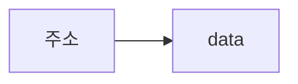

# 자율주행 시스템 관련 고급 개발자 양성 과정 개요

## 2018.09.18


내용 : 시스템 구축을 위해 현업 장비를 이용한 스마트카 시스템과 운영시스템환경을 구축하고

차량에 탑재되는 스마트 패드와 차량 데이터 시스템을 구축할 수있는 인재 양성


응용 SW 엔지니어링   				

DATAbase 엔지니어링		 	

UI & 서버 프로그램				

​	+ 								

스마트 패드

안드로이드 프로그램

스마트 카IOT

데이터분석 및 운영시스템 구축


IOT, 웹 , 데이터 시각화(분석) 할 수 알수있도록 교육


## java 기초설명

### 1. JDK소개

java.~ 핵심 라이브러리

javax.~ 확장패키지

java는 인터프리터와 컴파일러 병행 = C, C++ 보다 빠를수없다

jdk1.3 부터 hotspot engine 탑재로 성능 빨라짐 but C, C++ 보다 빠를수없다


### 2. java 언어적인 특징

- Simple : 대중성 기반
- Object-Oriented
- Memory : Garbage Collector
- Robust : 이 코드가 System을 건드리지 않고 안전하게 돌것인가.
- System independent : 플랫폼 독립적이다( JVM).
- Multi-Thread
- Dynamic : 동적이다.


### 3. java 응용분야

- Applet
- Sevelet & JSP
- 모바일과 임베디드
- EJB
- 안드로이드 앱

### 4. Eclipse

class는 대문자로 시작(파일명은 클래스명)

클래스안에는 변수와 메소드만 사용 가능


### 단축키 

| 단축키 | 내용 |
| ------ | -------- |
|    `ctrl` + `space`    |       자동완성   |
| `ctrl` + `alt` + `↓` |현재라인을 다음라인에 복사|
|`ctrl` + `↓`|현재라인을 다음라인에 잘라넣기|
|`ctrl` + `D`|현재라인 삭제|


`System.out.println` : 문장완성후 다음라인 부터 시작

`System.out.print` : 현재라인부터 시작


도스창에서 실행시 bin 까지

```shell
C:\Workspace\Java\HelloWorld\bin>java Day01.Hello
hello
hello
```


클래스 이름 변경시 마우스 오른쪽키 → refactoring 기능 사용 해야됨

`java.lang` : 다양한 패키지 자유롭게 사용가능, 생략 가능

new를하지 않아도 static 하면 메모리에 뜸(static 하지않은 자원들은 new를 해줘야함)


```java
package day01;
//import시 패키지명 생략 가능
import java.util.Date;
//패키지 명이 동일시 두개중 하나 선택해야함
//import java.sql.Date;

class Test01 {

	public static void main(String[] args) {
		// TODO Auto-generated method stub
		
		
		System.out.println("java");
		//java.lang은 생략가능
		System.out.println(java.lang.Math.PI);
		System.out.println(Math.PI);
		
		//static 하지않은 자원들은 new를 해줘야함
		java.util.Date d = new java.util.Date();
		//import시 패키지명 생략 가능
		Date a = new java.util.Date();
		java.sql.Date t;
		System.out.println(d);
		System.out.println(a);
		//System.out.println(t);
	}

}

```


### Data Type

PDT(Primitive Data Type) 기본 데이터 형


Reference Data Type : 참조 데이터형 주소가 데이터를 가르킴




~~java.lang.~~string = "홍길동" : 세미 타입


구분자(식별자)와 키워드(예약어)


- 구분자
  - 클래스, 변수, 메소드
  - abstract, boolean,break,byte ....
  - const
- 예약어


